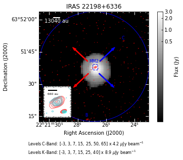
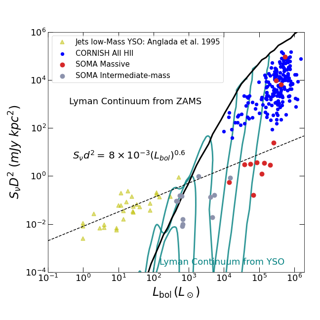
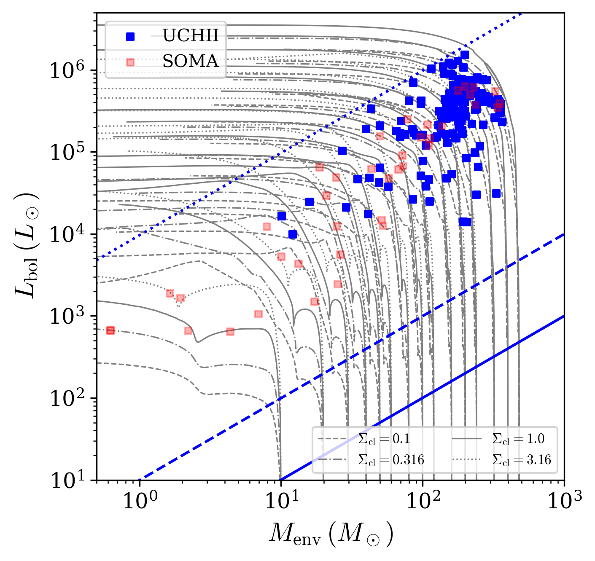

This repositary contains python scripts and jupyter notebooks with the results use on the Radio SOMA paper III () and also my 2022 CASSUM project as part of my work with the SOFIA Massive (SOMA) Star Formation Survey.

## Radio SOMA III: "The SOMA Radio Survey. III. Extended Spectral Energy Distributions of Intermediate Protostars"

## CASSUM Project: "The Final Stages of Massive Star Formation - Infrared Characterization of Ultra-Compact HII Regions"

